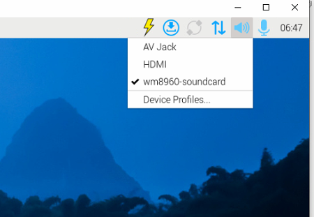
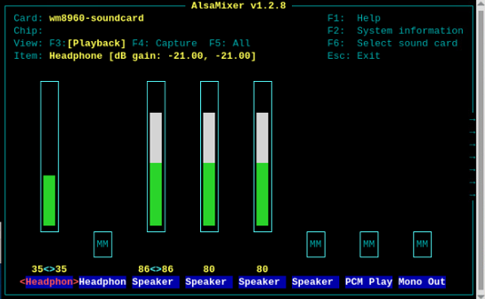
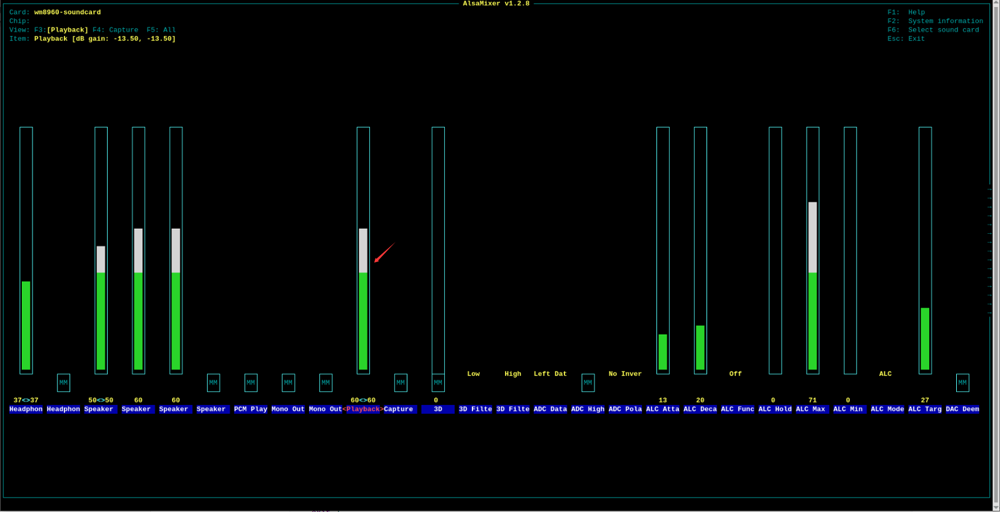

# raspi wm8960 driver

This repository provides instructions on how to use the WM8960 audio module with Raspberry Pi.

For detailed information about the WM8960 module, please visit: [www.minstru.com/modules/wm8960/](https://www.minstru.com/modules/wm8960).

## Hardware Connection

Connect the development board to the WM8960 using jumper wires, including power lines, ground lines, I2C SDA, SCL, and I2S BCLK, DCLK, DAC, ADC. Refer to the following image for pin connections:


| Raspi Pins | WM8960 Pins | Description                  |
| ---------- | ----------- | ---------------------------- |
| 5V         | VIN         | Power IN                     |
| GND        | GND         | Ground                       |
| GPIO2      | SDA         | I2C Data Input               |
| GPIO3      | SCL         | I2C Clock Input              |
| GPIO18     | BCLK        | I2S Bit Clock Input          |
| GPIO19     | DACLRC      | I2S Left/Right Channel Clock |
| GPIO20     | ADCDAT      | I2S Serial Data Input        |
| GPIO21     | DACDAT      | I2S Serial Data Output       |

## Update Software Sources

```bash
sudo apt-get -y update
sudo apt-get -y upgrade
```

## Download WM8960 Driver

Two methods: one is online using git clone; the other is offline by downloading the compressed file, extracting it, and uploading it to the Raspberry Pi.

```bash
# Method 1: Using git clone
git clone https://github.com/minstru/raspi_wm8960

# Method 2: Download the source code from GitHub in a browser, extract it, then upload (via SSH) to the Raspberry Pi
# Assuming audio_wm8960 is downloaded in the ~/Downloads folder
# Modify relevant file permissions
cd raspi_wm8960
chmod +x install.sh
chmod +x uninstall.sh
chmod +x wm8960-soundcard
```

## Install Driver

```bash
cd ~/Downloads/raspi_wm8960
sudo ./install.sh

sudo reboot
```

## Check if Driver Installation is Successful

```bash
vtino@raspberrypi:~ $ sudo dkms status
wm8960-soundcard/1.0, 6.12.25+rpt-rpi-v7, armv7l: installed
```

## Check Sound Card Devices

```bash
vtino@raspberrypi:~ $ aplay -l
**** List of PLAYBACK Hardware Devices ****
card 0: vc4hdmi [vc4-hdmi], device 0: MAI PCM i2s-hifi-0 [MAI PCM i2s-hifi-0]
  Subdevices: 1/1
  Subdevice #0: subdevice #0
card 1: wm8960soundcard [wm8960-soundcard], device 0: bcm2835-i2s-wm8960-hifi wm8960-hifi-0 [bcm2835-i2s-wm8960-hifi wm8960-hifi-0]
  Subdevices: 1/1
  Subdevice #0: subdevice #0
card 2: Headphones [bcm2835 Headphones], device 0: bcm2835 Headphones [bcm2835 Headphones]
  Subdevices: 8/8
  Subdevice #0: subdevice #0
  Subdevice #1: subdevice #1
  Subdevice #2: subdevice #2
  Subdevice #3: subdevice #3
  Subdevice #4: subdevice #4
  Subdevice #5: subdevice #5
  Subdevice #6: subdevice #6
  Subdevice #7: subdevice #7

vtino@raspberrypi:~ $ arecord -l
**** List of CAPTURE Hardware Devices ****
card 1: wm8960soundcard [wm8960-soundcard], device 0: bcm2835-i2s-wm8960-hifi wm8960-hifi-0 [bcm2835-i2s-wm8960-hifi wm8960-hifi-0]
  Subdevices: 1/1
  Subdevice #0: subdevice #0
```

## Adjust Volume

By default, the volume is relatively low, so adjustment is needed.

Right-click the speaker icon and select `wm8960-soundcard` from the pop-up options; right-click the recording icon and select `wm8960-soundcard` from the pop-up options.




Enter the following command, and press `F6` in the pop-up interface to select the sound card device.

```bash
sudo alsamixer
```


Use the arrow keys to select `wm8960-soundcard` and press Enter. You can see that the Headphone volume is currently 0.


You can increase its volume:




## Install MP3 Player: mpg123

```bash
sudo apt-get install mpg123 
```

## Test Audio Playback

Upload a test MP3 file to the Downloads folder, plug headphones into the WM8960 module's audio output jack. Play the MP3 using mpg123.

```bash
vtino@raspberrypi:~/Downloads $ ls
test.mp3  WM8960-Audio-HAT-master
vtino@raspberrypi:~/Downloads $ mpg123 test.mp3
High Performance MPEG 1.0/2.0/2.5 Audio Player for Layers 1, 2 and 3
        version 1.31.2; written and copyright by Michael Hipp and others
        free software (LGPL) without any warranty but with best wishes


Terminal control enabled, press 'h' for listing of keys and functions.

Playing MPEG stream 1 of 1: test.mp3 ...

MPEG 1.0 L III cbr128 44100 stereo

[1:49] Decoding of test.mp3 finished.
```

If your installed system has a graphical interface, you can also play MP3s using VLC.


Open the corresponding MP3 file via Media->Open File... to play it.

## Recording Test: Using the arecord Command

- The parameters 1,0 after -Dhw correspond to sound card 1 and device 0
- `CTRL+C` will stop the recording

```bash
vtino@raspberrypi:~/Downloads $ ls
test.mp3  test.wav  WM8960-Audio-HAT-master
vtino@raspberrypi:~/Downloads $ arecord -l
**** List of CAPTURE Hardware Devices ****
card 1: wm8960soundcard [wm8960-soundcard], device 0: bcm2835-i2s-wm8960-hifi wm8960-hifi-0 [bcm2835-i2s-wm8960-hifi wm8960-hifi-0]
  Subdevices: 1/1
  Subdevice #0: subdevice #0
vtino@raspberrypi:~/Downloads $ arecord -Dhw:1,0 -f cd test.wav
Recording WAVE 'test.wav' : Signed 16 bit Little Endian, Rate 44100 Hz, Stereo
Aborted by signal Interrupt...

vtino@raspberrypi:~/Downloads $ ls
test.mp3  test.wav  WM8960-Audio-HAT-master
vtino@raspberrypi:~/Downloads $

```

This will create a `test.wav` file in the `Downloads` folder. You can play this `wav` file using `aplay`.

```bash
vtino@raspberrypi:~/Downloads $ aplay test.wav
Playing WAVE 'test.wav' : Signed 16 bit Little Endian, Rate 44100 Hz, Stereo
```

## Loopback Playback

```
arecord -f cd -Dhw:1,0 | aplay -Dhw:1,0
```

You need to lower the playback volume slightly.



## Driver Uninstallation

```bash
sudo ./unsintall.sh
```