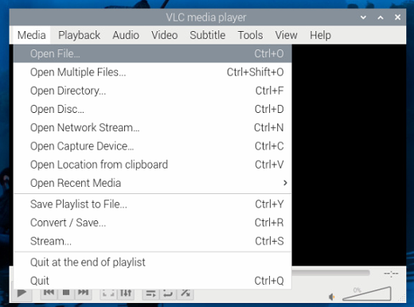

# raspi wm8960 driver

本仓库提供WM8960音频模块在树莓派上如何使用。

关于WM8960模块的详细资料，请访问：[www.minstru.com/modules/wm8960/](https://www.minstru.com/modules/wm8960)。

## 硬件连接

将开发板与WM8960通过杜邦线进行引脚连接，包括电源线，接地线，IIC的SDA，SCL，IIS的BCLK,DCLK,DAC,ADC。可参考以下图片进行引脚的连接：


| Raspi Pins | WM8960 Pins | Description                  |
| ---------- | ----------- | ---------------------------- |
| 5V         | VIN         | Power IN                     |
| GND        | GND         | Ground                       |
| GPIO2      | SDA         | I2C Data Input               |
| GPIO3      | SCL         | I2C Clock Input              |
| GPIO18     | BCLK        | I2S Bit Clock Input          |
| GPIO19     | DACLRC      | I2S Left/Right Channel Clock |
| GPIO20     | ADCDAT      | I2S Serial Data Input        |
| GPIO21     | DACDAT      | I2S Serial Data Output       |

## 更新软件源

```bash
sudo apt-get -y update
sudo apt-get -y upgrade
```

## 下载WM8960的驱动

两种办法：一种是在线的方式，使用git clone的方式；一种是离线的方式，将下载的压缩文件解压后上传到树莓派上。

```bash
# 方法一：使用git clone的方式
git clone https://github.com/minstru/audio_wm8960

#方法二：将github上的源码用浏览器中下载、解压，再上传（可以通过ssh的方式上传）到树莓派上
# 假设audio_wm8960下载在~/Downloads文件夹下
# 修改相关文件权限
cd audio_wm8960/raspi_wm8960
chmod +x install.sh
chmod +x uninstall.sh
chmod +x wm8960-soundcard
```

## 安装驱动

```bash
cd ~/Downloads/audio_wm8960/raspi_wm8960
sudo ./install.sh

sudo reboot
```

## 检查驱动是否安装成功

```bash
vtino@raspberrypi:~ $ sudo dkms status
wm8960-soundcard/1.0, 6.12.25+rpt-rpi-v7, armv7l: installed
```

## 检查声卡设备

```bash
vtino@raspberrypi:~ $ aplay -l
**** List of PLAYBACK Hardware Devices ****
card 0: vc4hdmi [vc4-hdmi], device 0: MAI PCM i2s-hifi-0 [MAI PCM i2s-hifi-0]
  Subdevices: 1/1
  Subdevice #0: subdevice #0
card 1: wm8960soundcard [wm8960-soundcard], device 0: bcm2835-i2s-wm8960-hifi wm8960-hifi-0 [bcm2835-i2s-wm8960-hifi wm8960-hifi-0]
  Subdevices: 1/1
  Subdevice #0: subdevice #0
card 2: Headphones [bcm2835 Headphones], device 0: bcm2835 Headphones [bcm2835 Headphones]
  Subdevices: 8/8
  Subdevice #0: subdevice #0
  Subdevice #1: subdevice #1
  Subdevice #2: subdevice #2
  Subdevice #3: subdevice #3
  Subdevice #4: subdevice #4
  Subdevice #5: subdevice #5
  Subdevice #6: subdevice #6
  Subdevice #7: subdevice #7

vtino@raspberrypi:~ $ arecord -l
**** List of CAPTURE Hardware Devices ****
card 1: wm8960soundcard [wm8960-soundcard], device 0: bcm2835-i2s-wm8960-hifi wm8960-hifi-0 [bcm2835-i2s-wm8960-hifi wm8960-hifi-0]
  Subdevices: 1/1
  Subdevice #0: subdevice #0
```

## 调整音量

默认情况下，音量比较小，所以需要调整音量

右键点击小喇叭的图标，弹出的选项中选择`wm8960-soundcard`；右键点击录音的图标，弹出的选项中选择`wm8960-soundcard`;


输入如下命令，弹出界面按`F6`以选择声卡设备

```bash
sudo alsamixer
```


这里通过方向键选中`wm8960-soundcard`后回车。可以看到现在Headphone的音量为0


可以将其音量调大：


## 安装mp3播放器：mpg123

```bash
sudo apt-get install mpg123 
```

## 测试播放音频

上传一个测试用的mp3文件到Downloads文件夹下，将耳机传入WM8960模块的音频输出接口。通过mpg123播放mp3

```bash
vtino@raspberrypi:~/Downloads $ ls
test.mp3  WM8960-Audio-HAT-master
vtino@raspberrypi:~/Downloads $ mpg123 test.mp3
High Performance MPEG 1.0/2.0/2.5 Audio Player for Layers 1, 2 and 3
        version 1.31.2; written and copyright by Michael Hipp and others
        free software (LGPL) without any warranty but with best wishes


Terminal control enabled, press 'h' for listing of keys and functions.

Playing MPEG stream 1 of 1: test.mp3 ...

MPEG 1.0 L III cbr128 44100 stereo

[1:49] Decoding of test.mp3 finished.
```

如果你安装的系统是带有图形界面，也可以通过vlc播放mp3




通过Media->Open File...打开相应的mp3即可播放。

## 录音测试：通过arecord命令

- -Dhw后面的参数1,0，对应的是声卡1和设备0
- `CTRL+C`会停止录音

```bash
vtino@raspberrypi:~/Downloads $ ls
test.mp3  test.wav  WM8960-Audio-HAT-master
vtino@raspberrypi:~/Downloads $ arecord -l
**** List of CAPTURE Hardware Devices ****
card 1: wm8960soundcard [wm8960-soundcard], device 0: bcm2835-i2s-wm8960-hifi wm8960-hifi-0 [bcm2835-i2s-wm8960-hifi wm8960-hifi-0]
  Subdevices: 1/1
  Subdevice #0: subdevice #0
vtino@raspberrypi:~/Downloads $ arecord -Dhw:1,0 -f cd test.wav
Recording WAVE 'test.wav' : Signed 16 bit Little Endian, Rate 44100 Hz, Stereo
Aborted by signal Interrupt...

vtino@raspberrypi:~/Downloads $ ls
test.mp3  test.wav  WM8960-Audio-HAT-master
vtino@raspberrypi:~/Downloads $

```

这时在`Downloads`文件夹下会产生一个`test.wav`文件。可以通过`aplay`播放该`wav`文件

```bash
vtino@raspberrypi:~/Downloads $ aplay test.wav
Playing WAVE 'test.wav' : Signed 16 bit Little Endian, Rate 44100 Hz, Stereo
```

## 回环播放

```
arecord -f cd -Dhw:1,0 | aplay -Dhw:1,0
```

需要将palyback的音量调小一些。


## 驱动卸载

```bash
sudo ./unsintall.sh
```

